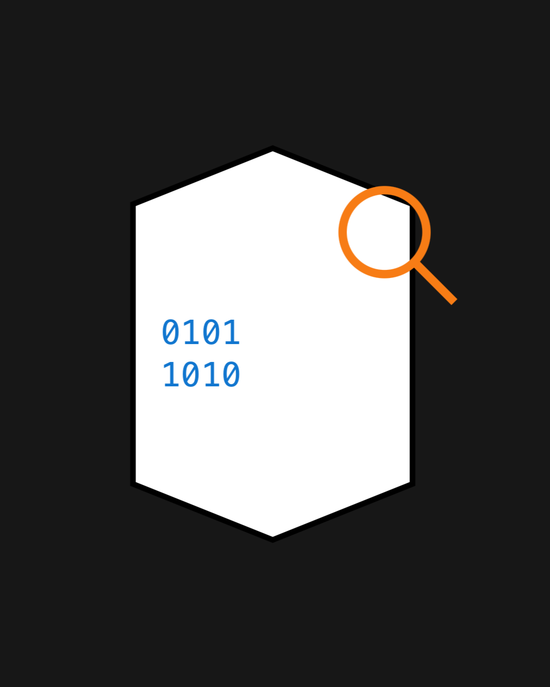

# Legal Lens AI: Simplify Terms of Service with AI

A Chrome extension that uses Google's Gemini AI to translate complex Terms of Service agreements into plain language summaries.



## Overview

Legal Lens AI empowers users to understand what they're agreeing to when they click "I Accept" on Terms of Service agreements. By leveraging the power of Google's Gemini AI, our extension:

- Analyzes Terms of Service agreements with advanced AI
- Provides a concise, plain-language summary of key points
- Highlights potential concerns and red flags users should be aware of
- Presents results in a clean, user-friendly interface

## Installation

### For Users
1. Clone this repository or download the latest release
2. Open Chrome and navigate to `chrome://extensions/`
3. Enable "Developer mode" (toggle in the top right)
4. Click "Load unpacked" and select the project directory
5. The extension icon should appear in your browser toolbar

### For Developers
1. Clone this repository
2. Install dependencies:
   ```
   npm install
   ```
3. Get a Gemini AI API key from [Google AI Studio](https://makersuite.google.com/app/apikey)
4. Create a `.env` file in the root directory with your API key:
   ```
   REACT_APP_GEMINI_API_KEY=your_api_key_here
   ```
5. Build the extension:
   ```
   npm run build
   ```
6. Load the extension in Chrome as described in the "For Users" section

## Usage

1. Click on the Legal Lens AI extension icon in your browser
2. Click "Get Started" to begin
3. Paste your terms of service text into the analyzer
4. Click "Analyze" to receive a simplified summary and list of potential concerns
5. Navigate back to analyze more text or return to the home screen

## Technology Stack

- **React.js** - Frontend UI library
- **React Router** - Navigation and routing
- **Tailwind CSS** - Styling and UI components
- **Google's Gemini AI API** - Natural language processing
- **Chrome Extension API** - Browser integration
- **Webpack** - Module bundling

## Features

- **Clean, Intuitive Interface**: A modern UI that makes complex information accessible
- **AI-Powered Analysis**: Leveraging Gemini AI for accurate summaries and concern detection
- **Responsive Design**: Adapts to different browser window sizes
- **Robust Error Handling**: Graceful handling of API failures and edge cases

## Development

For development with auto-rebuild:
```
npm run dev
```

### Project Structure

- `src/components/App.jsx` - Main application component with routing
- `src/components/routes/` - Page components for different views
- `src/services/geminiService.js` - Gemini AI integration service
- `public/` - Static assets and HTML template
- `dist/` - Compiled extension files (output from build)

## Future Enhancements

- Auto-detection of Terms of Service on websites
- Comparison feature to evaluate against industry standards
- Customizable analysis based on user priorities
- Historical tracking of Terms of Service changes
- Mobile version for on-the-go users
- Expanded language support

## Contributing

Contributions are welcome! Please feel free to submit a Pull Request.

## License

[MIT License](LICENSE)

## Acknowledgments

- Google's Gemini AI for powering the analysis
- The open source community for providing excellent tools and libraries